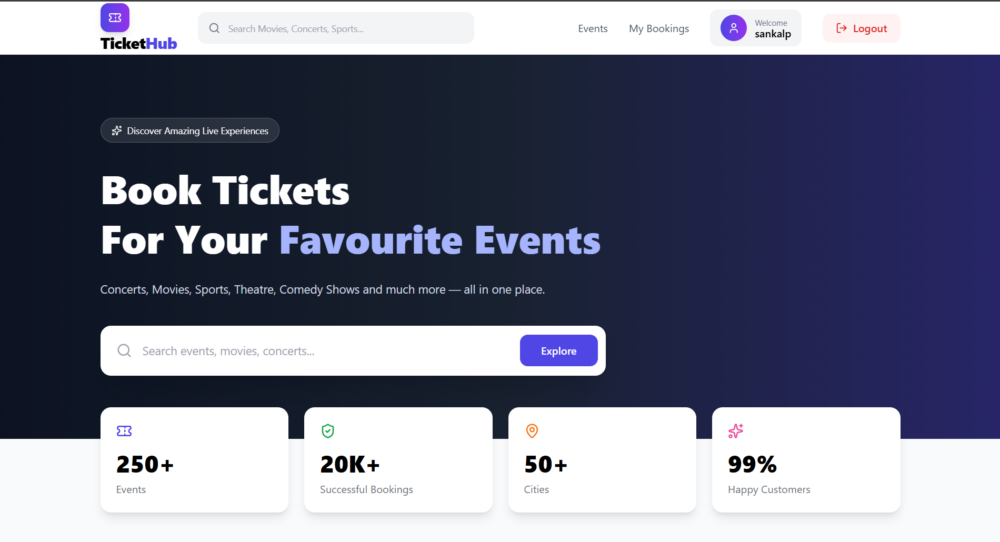

# 🎟️ Ticket Booking Platform

A full-stack Ticket Booking Platform built for high-demand events such as movies, concerts, and live shows. The platform provides a secure and scalable booking experience with real-time seat management, automatic seat hold expiration, waitlist management, QR code ticket generation, and email notifications.

> Developed as part of the **Unthinkable Solutions Backend Assessment**.

---

# 🚀 Live Demo

**Frontend:** https://your-vercel-url.vercel.app

**Backend API:** https://your-render-url.onrender.com

---

# ✨ Features

## Authentication & Authorization

- JWT Authentication
- Role-Based Access Control
- Customer
- Organizer
- Admin
- Protected Routes
- Password Encryption using bcrypt

---

## Venue Management (Admin)

- Create Venues
- Define Seat Categories
- Automatic Seat Generation
- Venue Management

---

## Event Management (Organizer)

- Create Events
- Update Events
- Publish Events
- Per-category Pricing
- Booking Analytics
- Revenue Summary

---

## Customer Features

- Browse Events
- Search & Filter Events
- Visual Seat Map
- Seat Category Pricing
- Booking History
- Booking Cancellation
- Waitlist Enrollment

---

## Booking System

- Interactive Seat Selection
- Seat Hold Mechanism
- Automatic Hold Expiration
- Real-Time Seat Availability
- Booking Confirmation

---

## Waitlist System

- Join Waitlist for Sold-Out Events
- FIFO Queue
- Automatic Seat Promotion
- Email Notification
- Time-Limited Offer
- Automatic Reallocation

---

## QR Ticket System

Every successful booking generates:

- QR Code
- Booking Reference
- Ticket Details
- Email Delivery

---

## Email Notifications

- Booking Confirmation
- QR Ticket
- Waitlist Promotion
- Booking Updates

---

# 🛠 Tech Stack

## Frontend

- React.js
- React Router
- Tailwind CSS
- Axios
- React Hot Toast
- Lucide Icons

---

## Backend

- Node.js
- Express.js
- MongoDB
- Mongoose

---

## Authentication

- JWT
- bcrypt

---

## Email

- Nodemailer
- Gmail SMTP

---

## QR Code

- qrcode

---

## Scheduler

- node-cron

---

#  Project Structure

```
Ticket-Booking
│
├── client
│   ├── src
│   ├── components
│   ├── pages
│   ├── api
│   └── ...
│
├── server
│   ├── src
│   │
│   ├── controllers
│   ├── services
│   ├── models
│   ├── routes
│   ├── middleware
│   ├── validators
│   ├── jobs
│   ├── utils
│   ├── constants
│   └── ...
│
├── README.md
├── .env.example
└── LICENSE
```

---

#  Database Schema

## User

- Customer
- Organizer
- Admin

---

## Venue

- Name
- Location
- Seat Categories

---

## Event

- Venue
- Organizer
- Date
- Time
- Price
- Status

---

## Seat

- Event
- Row
- Column
- Category
- Status

---

## Seat Hold

- Seat
- Customer
- Expiration Time

---

## Booking

- User
- Event
- Seats
- Total Amount
- Status

---

## Waitlist

- Event
- Category
- User
- Position
- Status

---

## Waitlist Offer

- Waitlist Entry
- Seat
- Expiration
- Status

---

#  Booking Workflow

```
Customer
      │
      ▼
Select Event
      │
      ▼
Select Seats
      │
      ▼
Seat Hold Created
      │
      ▼
Checkout
      │
      ▼
Payment Success
      │
      ▼
Booking Created
      │
      ▼
QR Generated
      │
      ▼
Email Sent
```

---

#  Seat Hold TTL

The platform prevents seat conflicts using temporary seat holds.

### Flow

1. Customer selects seats
2. Seats become HELD
3. Hold expires after configurable TTL
4. Scheduler releases expired holds
5. Seats become AVAILABLE again

---

# 🔒 Concurrency Protection

To prevent double booking:

- MongoDB Transactions
- Atomic Updates
- Seat Status Verification
- Transaction Rollback
- Race Condition Prevention

Result:

Two customers cannot successfully book the same seat simultaneously.

---

#  Waitlist Flow

```
Event Sold Out
        │
        ▼
Join Waitlist
        │
        ▼
Customer Cancels
        │
        ▼
Seat Released
        │
        ▼
First Waitlisted Customer
        │
        ▼
Email Offer
        │
        ▼
Accept within TTL
      /     \
    Yes      No
    │         │
Booking    Next Customer
Created
```

---

#  API Endpoints

## Authentication

| Method | Endpoint |
|---------|----------|
| POST | /auth/register |
| POST | /auth/login |
| GET | /auth/profile |

---

## Events

| Method | Endpoint |
|---------|----------|
| GET | /events |
| GET | /events/:id |
| POST | /events |

---

## Bookings

| Method | Endpoint |
|---------|----------|
| POST | /bookings |
| GET | /bookings |
| PATCH | /bookings/:id/cancel |

---

## Seats

| Method | Endpoint |
|---------|----------|
| GET | /seats/:eventId |

---

## Waitlist

| Method | Endpoint |
|---------|----------|
| POST | /waitlist |
| GET | /waitlist |
| POST | /waitlist/offers/:id/accept |

---

# ⚙️ Installation

## Clone Repository

```bash
git clone https://github.com/Shubham-Mohite-hub/Ticket-Booking.git
```

Backend:

```bash
cd server
npm install
npm run dev
```

Frontend:

```bash
cd client
npm install
npm run dev
```

---

# 🔑 Environment Variables

Create a `.env` file inside the `server` folder.

```env
PORT=

MONGODB_URI=

JWT_SECRET=

JWT_EXPIRES_IN=

SMTP_HOST=

SMTP_PORT=

SMTP_USER=

SMTP_PASSWORD=

SMTP_FROM_EMAIL=

FRONTEND_URL=
```

---




- Home Page
- Event Details
- Seat Selection
- Booking Success
- QR Ticket Email
- Waitlist Flow
- Admin Dashboard
- Organizer Dashboard

---

# 🚀 Deployment

| Service | Platform |
|----------|----------|
| Frontend | Vercel |
| Backend | Render |
| Database | MongoDB Atlas |

---

# 🔮 Future Improvements

- Stripe/Razorpay Integration
- WebSocket-based Live Seat Updates
- Seat Recommendations
- Event Analytics Dashboard
- Mobile Responsive Improvements
- Docker Support
- CI/CD Pipeline
- Unit & Integration Tests

---

# 👨‍💻 Author

**Shubham Mohite**

- GitHub: https://github.com/Shubham-Mohite-hub
- LinkedIn: www.linkedin.com/in/shubham-mohite-6a34492a9

---

# 📄 License

This project is licensed under the MIT License.